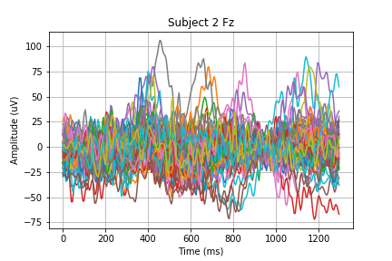
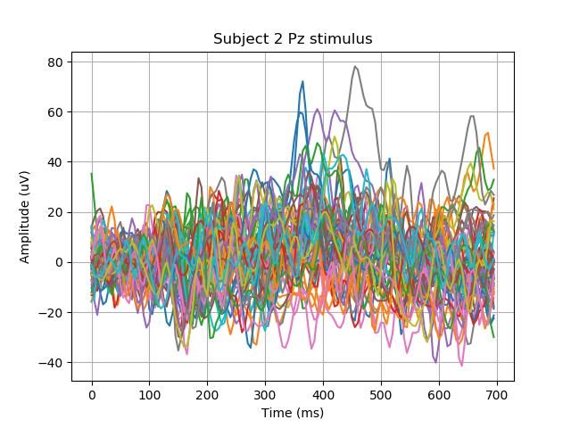
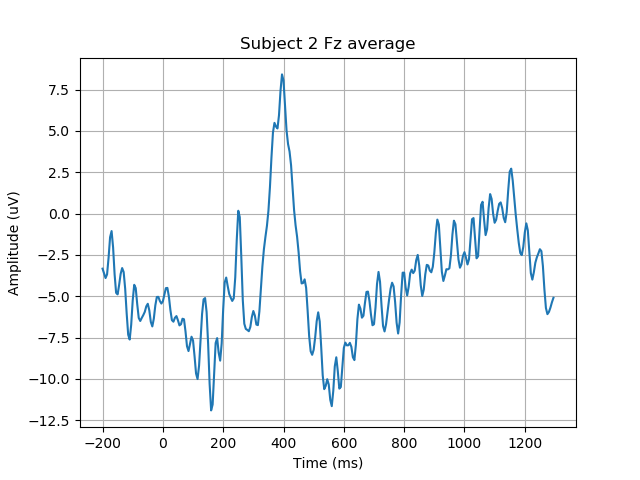
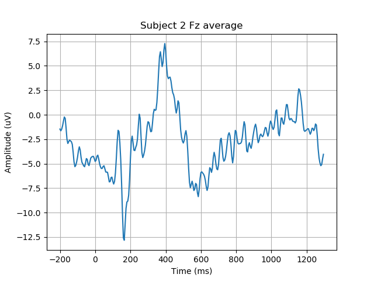
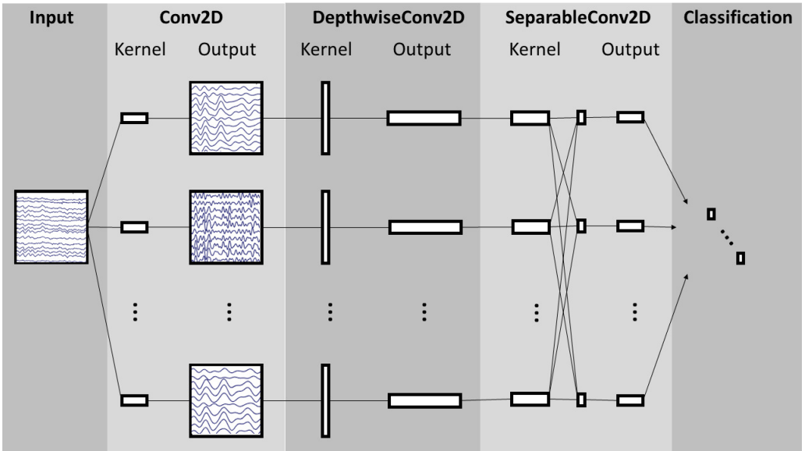
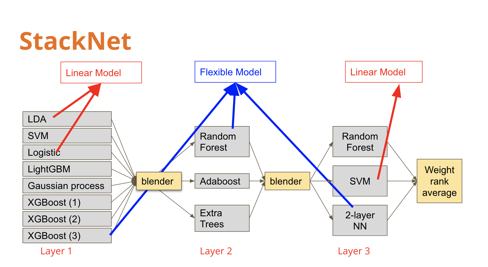

# COGS189 Final Project
## BCI Challenge @ NER 2015

**Authors**:
Yundong Wang, Zimu Li, Haoran Zhang, Yadi Deng

## Introduction

This project applied machine learning techniques to the P300 speller classification challenge at Kaggle BCI Challenge @ NER 2015. The P300 speller is a brain-computer interface paradigm that allows one to input text or commands to a computer via brain activity measured by electroencephalography (EEG).

xDAWN “Covariance algorithm and Tangent Space algorithm” which uses the spatial correlations of the simultaneously recorded EEG as features for the error detection classification are implemented.

We applied multiple machine learning techniques (SVM, Logistic Regression, Random Forest, etc) and deep learning model dedicated for EEG data ([EEGNET](https://arxiv.org/pdf/1611.08024.pdf)). Lastly, we built a StackNet model that achieved the 4th best AUC (0.803) result compared to the candidates pool.

The presentation slides can be found [here.](https://docs.google.com/presentation/d/16Orsav1K4bPTFhPx3TsfYNxzgrvTMb2Gcf9RTC6WYmU/edit?ts=5c8aa323#slide=id.g5231037314_0_0)

# Dataset
Each session include 60 target stimulus, however, the last session of each subject contains 100 target stimulus. Which makes 340 target stimulus for each subject

Data is collected at 200 Hz across 26 subjects (16 for training, 10 for testing). Each subject participated in 5 different sessions.

0 or 1 for bad or good feedback, respectively. Bad feedback is when the selected item is different from the expected item. Good feedback is when the selected item is similar to the expected item.

The Kaggle description and dataset can be downloaded [here.](https://www.kaggle.com/c/inria-bci-challenge)

## Requirements

To run python code, please download data from https://www.kaggle.com/c/inria-bci-challenge/data and put *train* and *test* directories under *data*. **Python version: 3.6**

To run *preprocess.py*, install **pyriemann** packages using pip.

To run *EEGNET.py*, install EEGModels at https://github.com/vlawhern/arl-eegmodels and required **TensorFlow** packages.

To run *StackNet.py*, install **pystacknet** at https://github.com/h2oai/pystacknet, install **LightGBM** and **XGBoost** using conda or pip.

## Samples of Epoched EEG data
<table>
    <tbody>
        <tr>
            <td>
                
            </td>
            <td>
                
            </td>
        </tr>
        <tr>
            <td>
                
            </td>
            <td>
                
            </td>
        </tr>
    </tbody>
</table>

## EEGNET archetectures

## StackNet Architectures

## Sample results
Attached below are the results of models we applied to the pre-processed EEG data.

# Acknowledgements
* Rivet, B.; Souloumiac, A.; Attina, V.; Gibert, G., "xDAWN Algorithm to Enhance Evoked Potentials: Application to Brain–Computer Interface," IEEE Transactions on Biomedical Engineering, vol.56, no.8, pp.2035,2043, Aug. 2009

*  A. Barachant, S. Bonnet, M. Congedo and C. Jutten, “Multiclass Brain-Computer Interface Classification by Riemannian Geometry,” in IEEE Transactions on Biomedical Engineering, vol. 59, no. 4, p. 920-928, 2012 [PDF](http://hal.archives-ouvertes.fr/docs/00/68/13/28/PDF/Barachant_tbme_final.pdf)

* A. Barachant, S. Bonnet, M. Congedo and C. Jutten, “Classification of covariance matrices using a Riemannian-based kernel for BCI applications“, in NeuroComputing, vol. 112, p. 172-178, 2013 [PDF](http://hal.archives-ouvertes.fr/docs/00/82/04/75/PDF/BARACHANT_Neurocomputing_ForHal.pdf)

* Lawhern, Vernon J. EEGNet: A Compact Convolutional Network for EEG-based Brain-Computer Interfaces, 23 Nov. 2016, arxiv.org/abs/1611.08024v4. Accessed 16 Mar. 2019 [PDF](https://arxiv.org/pdf/1611.08024.pdf)
